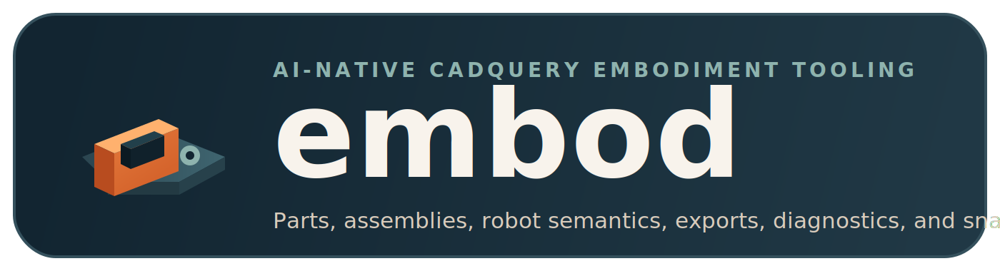
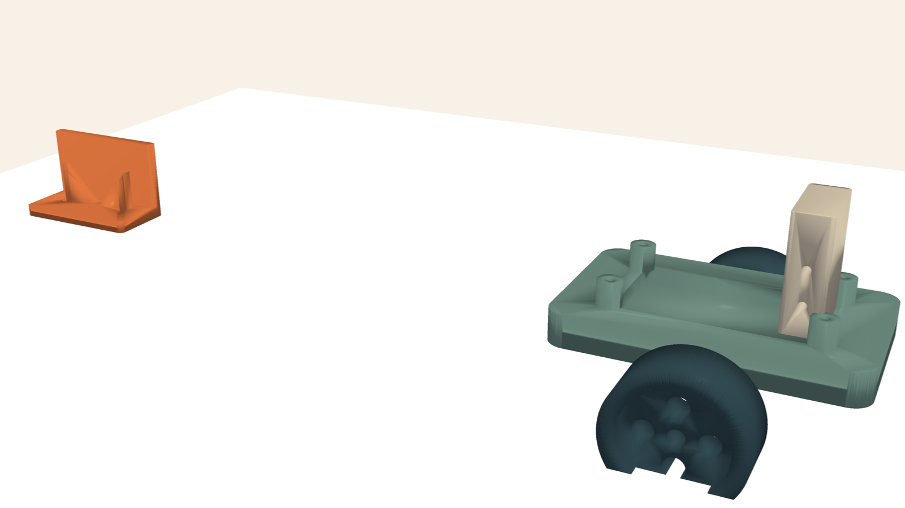
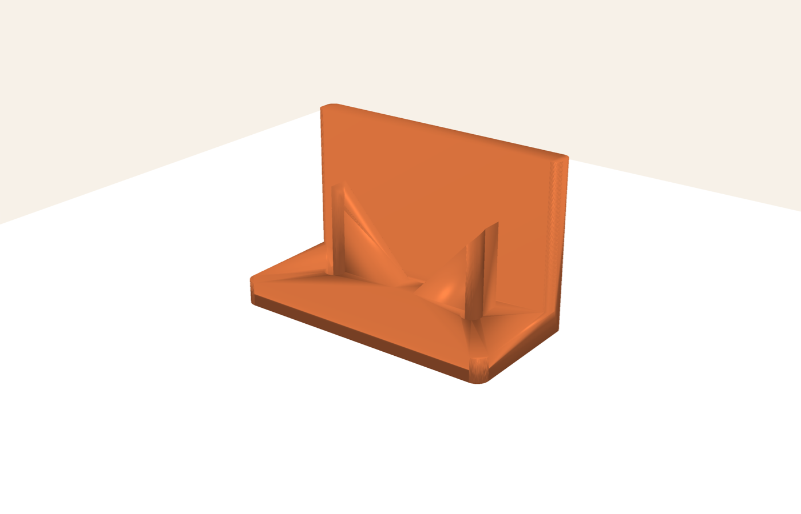
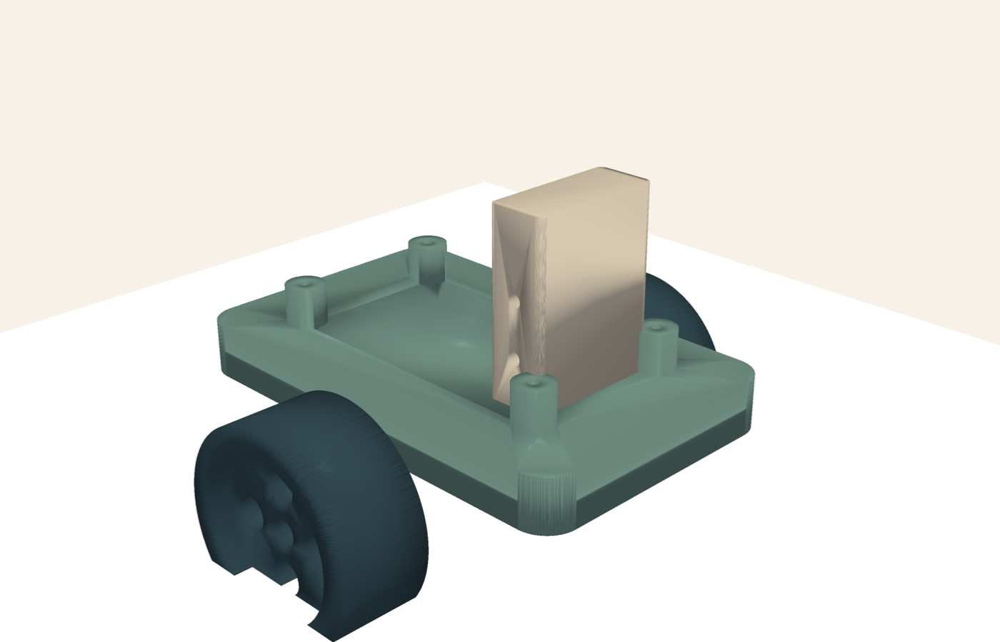
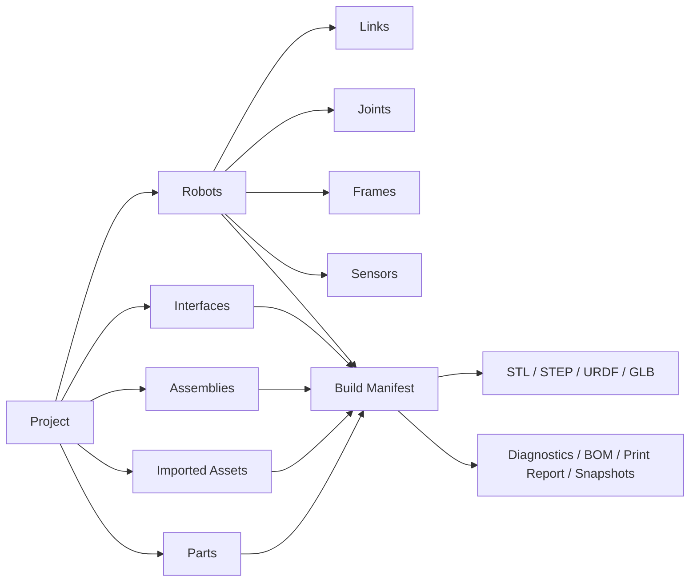

<p align="center">
  
</p>

<p align="center">
  Code-first embodiment tooling for manufacturable parts, assemblies, and robot semantics.
</p>

<p align="center">
  
  
  
  
  
  
</p>

<p align="center">
  
</p>

Embod is a Python-first CADQuery toolchain for AI-assisted mechanical design.
A single project graph can describe manufacturable parts, imported geometry,
assemblies, interfaces, and robot metadata, then drive CLI workflows for
inspection, validation, exports, reports, and deterministic snapshots.

## Why Embod

- Model fabrication and robotics in one place instead of splitting them across
  disconnected scripts.
- Keep geometry explicit in millimeters and metadata explicit in machine-readable
  manifests.
- Export practical outputs such as `stl`, `step`, `urdf`, `glb`, snapshots, BOMs,
  and printability reports.
- Give AI tools a stable, CLI-native loop for inspecting a project, validating
  it, building it, and checking the result visually.
- Stay strict: typed models, no blanket `Any`, and quality gates through
  `ruff`, `mypy --strict`, and `pytest`.

## What Embod Models

- `Part`: CADQuery geometry plus material, notes, interfaces, print settings,
  and mesh tessellation controls.
- `ImportedAsset`: external geometry that still participates in the project
  graph and downstream exports.
- `Assembly`: named placements of parts and subassemblies for fabrication or
  visual layout.
- `InterfaceDef`: explicit mounting and mating metadata instead of comments or
  ad hoc dictionaries.
- `Robot`: a robotics layer over the fabrication graph with links, joints,
  frames, sensors, collision shapes, and inertial proxies.
- `BuildManifest`: a machine-readable artifact that captures the entire build,
  its exports, and generated snapshots.

## Gallery

<table>
  <tr>
    <td width="50%">
      
      <p><strong>Bracket Example</strong><br/>A printable structural bracket with mesh and print metadata attached to the model.</p>
    </td>
    <td width="50%">
      
      <p><strong>Robot Example</strong><br/>A small diff-drive concept with printable parts, robot links, joints, and sensor frame semantics.</p>
    </td>
  </tr>
</table>

## Project Graph



## Install

### Recommended CLI Install

Install the editable repo with the full visualization stack:

```bash
uv tool install --python 3.11 --editable '.[full]'
```

This exposes `embod` on your `PATH` while keeping the checkout editable. If
`uv` warns that its tool bin directory is missing from `PATH`, run:

```bash
uv tool update-shell
```

### Smaller Install

Skip visualization extras if you only need the core model and export path:

```bash
uv tool install --python 3.11 --editable .
```

### Contributor Setup

If you are working from the repository directly, sync the dev environment
instead of installing a tool:

```bash
uv sync --extra full
```

`uv build` is for packaging distributions into `dist/`; it is not the normal
way to use the CLI during development.

## Quickstart

Create a robot project, inspect it, validate it, build it, export a URDF, and
generate a CAD snapshot:

```bash
embod new demo-bot --template robot
embod inspect demo-bot/embod_project.py --json
embod validate demo-bot/embod_project.py --json
embod build demo-bot/embod_project.py --json
embod export demo-bot/embod_project.py --format urdf
embod snapshot demo-bot/embod_project.py --scene cad --subject robot_visual --json
embod simulate demo-bot/embod_project.py --smoke
```

For local development through `uv`, the same flow is:

```bash
uv run embod inspect examples/simple_bracket.py --json
uv run embod validate examples/simple_bracket.py --checks geometry,print --json
uv run embod build examples/diff_drive_robot.py --json
uv run embod snapshot examples/diff_drive_robot.py --scene cad --subject robot_visual --json
```

## Example

Embod projects are plain Python with an explicit graph. A small example looks
like this:

```python
import cadquery as cq

from embod import MeshProfile, PrintProfile, Project

project = Project("simple_bracket")

bracket = (
    cq.Workplane("XY")
    .box(68.0, 34.0, 6.0)
    .edges("|Z")
    .fillet(3.0)
)

project.part(
    name="bracket",
    geometry=bracket,
    mesh_profile=MeshProfile(tolerance_mm=0.03, angular_tolerance_rad=0.025),
    print_profile=PrintProfile(
        process="fdm",
        material="PETG",
        layer_height_mm=0.2,
        nozzle_mm=0.4,
        orientation="flat",
        max_build_volume_mm=(256.0, 256.0, 256.0),
    ),
    tags=["printable", "structural"],
)
```

See [`examples/simple_bracket.py`](examples/simple_bracket.py) and
[`examples/diff_drive_robot.py`](examples/diff_drive_robot.py) for fuller
examples.

## CLI Surface

| Command | What it does |
| --- | --- |
| `embod capabilities --json` | Report supported commands, export formats, and extras. |
| `embod new <name> --template ...` | Scaffold a new part, assembly, or robot project. |
| `embod inspect <project> --json` | Return project structure without manual parsing. |
| `embod validate <project> --checks ... --json` | Run geometry, graph, print, and robot diagnostics. |
| `embod build <project> --json` | Build the project graph and emit the manifest. |
| `embod export <project> --format step` | Copy a selected export to a target path. |
| `embod snapshot <project> --scene cad --subject ...` | Render deterministic CAD, collision, or sim snapshots. |
| `embod preview <project> --subject ...` | Generate a quick image preview. |
| `embod bom <project> --json` | Emit a simple bill of materials view. |
| `embod print-report <project> --json` | Extract printability warnings from diagnostics. |
| `embod simulate <project> --smoke` | Run a smoke validation pass on robot URDF output. |
| `embod doctor --json` | Report local capability availability. |
| `embod schema <name>` | Print JSON schema for key machine-readable outputs. |

## Outputs

Embod is built around machine-readable artifacts rather than human-only console
text. A typical build can produce:

- `manifest.json` with project metadata, entities, exports, and snapshot records
- `stl` and `step` exports for parts
- `glb` and `step` exports for assemblies
- `urdf` exports for robot models
- deterministic snapshot images and JSON camera metadata
- diagnostics reports, BOM payloads, and printability reports

## AI Workflow

AI clients should prefer the CLI instead of scraping source files manually:

1. `embod capabilities --json`
2. `embod inspect <project> --json`
3. Edit `embod_project.py`
4. `embod validate <project> --json`
5. `embod build <project> --json`
6. `embod export <project> --format step`
7. `embod snapshot <project> --scene cad --subject <part-or-assembly> --json`
8. `embod simulate <project> --smoke`

This repository also ships guidance for tool-native coding agents:

- [`AGENTS.md`](AGENTS.md) for Codex and generic agent clients
- [`CLAUDE.md`](CLAUDE.md), `.claude/skills`, and `.claude/agents` for Claude Code
- [`.cursor/rules`](.cursor/rules) for Cursor
- [`docs/ai/codex.md`](docs/ai/codex.md) for Codex-specific workflow notes
- [`docs/ai/claude-code.md`](docs/ai/claude-code.md) for Claude Code workflow notes
- [`docs/ai/cursor.md`](docs/ai/cursor.md) for Cursor workflow notes
- [`docs/ai/agent-workflow.md`](docs/ai/agent-workflow.md) for the repo-wide design loop
- [`docs/ai/example-queries.md`](docs/ai/example-queries.md) for prompt examples
- [`docs/ai/tool-support.md`](docs/ai/tool-support.md) for tool support details

## Development

Run the standard checks from the repository root:

```bash
uv run ruff check .
uv run mypy src tests
uv run pytest -q
```

The current quality bar is:

- no blanket `ignore_missing_imports`
- no `Any` in `src/` or `tests/`
- no lint/type suppressions as a default escape hatch
- optional dependencies wrapped behind typed interfaces

## Repository Layout

| Path | Purpose |
| --- | --- |
| `src/embod/` | Core model, CLI, exporters, loaders, validators, simulation, and visualization |
| `examples/` | Small sample projects for parts and robots |
| `tests/` | CLI tests, fixture cases, and exporter coverage |
| `docs/ai/` | Agent-oriented usage and workflow guidance |
| `out/` | Example exported meshes used by the repo |

## Status

Embod is still in MVP territory, but the current scope is already useful for
code-first mechanical design work where explicit graph structure, validation,
and reproducible exports matter more than a GUI-first workflow.
